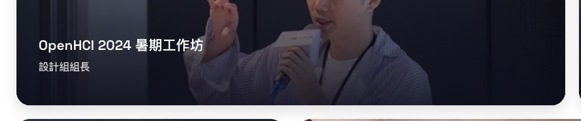

# Iteration: about-me — educator-card-body

| 項目 | 值 |
|------|----|
| 時間 | 2026/6/6 上午1:22:06 |
| 頁面 | http://localhost:3000/about-me |
| 元件 | `educator-card-body` |
| 檔案 | `app/globals.css` |
| 截圖範圍 | 元件範圍 |

## Before


## After


## 設計說明

- **Before 的問題**：`.educator-reveal` class 通過 `opacity: 1; transform: none;` 強制將卡片設定為「完全展開」狀態，這在 768px 以下的小螢幕上會干擾 hover 動畫的運作——用戶無法看到滑過卡片時文字逐漸出現的動畫效果，只能看到靜態的展開內容，喪失了互動反饋感。

- **After 的改動**：刪除了 `.educator-reveal` 這個強制展開狀態的 class，讓小螢幕上的 educator 卡片恢復正常的 hover 動畫邏輯。這樣各螢幕尺寸都能保持一致的互動體驗，用戶在触及卡片時能看到說明文字的漸現動畫，而不是被硬編碼的靜態狀態阻擋。

<details>
<summary>Code diff</summary>

**Before:**
```
  .educator-card-body {
    padding: 20px 24px;
  }

  /* 觸控裝置無 hover：介紹文直接展開顯示 */
  .educator-reveal {
    grid-template-rows: 1fr;
    opacity: 1;
    transform: none;
  }
```

**After:**
```
  .educator-card-body {
    padding: 20px 24px;
  }
```

</details>