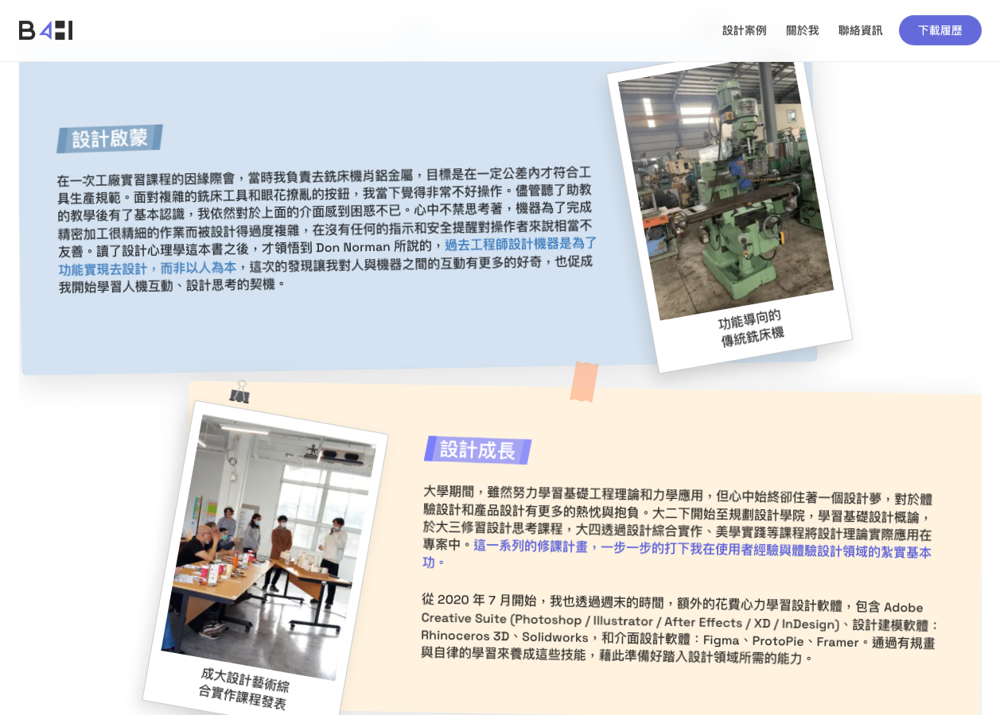

# Iteration: about-me — growth-grid

| 項目 | 值 |
|------|----|
| 時間 | 2026/6/6 下午12:49:09 |
| 頁面 | http://localhost:3000/about-me |
| 元件 | `growth-grid` |
| 檔案 | `app/globals.css` |
| 截圖範圍 | 元件範圍 |

## Before


## After


## 設計說明

- **Before 的問題**：使用 `overflow: hidden` 同時裁掉水平和垂直方向超出邊界的內容，導致故意設計要露出的視覺元素（膠帶、迴紋針、拍立得上緣）被容器蓋住無法完整顯示。無法同時解決「防止頁面出現水平捲軸」和「保留上方裝飾元素露出空間」的矛盾。

- **After 的改動**：將 overflow 分軸控制——X 軸改為 `clip` 只做邊界剪裁（防止水平溢位導致頁面捲軸），Y 軸改為 `visible` 完全開放（允許上下方元素露出）。搭配 `padding-top: 28px` 為上方的膠帶、迴紋針預留顯示空間，確保拍立得及其上方的固定裝飾物件都能完整呈現，兼顧設計完整性與頁面捲軸的視覺整潔。

<details>
<summary>Code diff</summary>

**Before:**
```
.growth-grid {
  display: flex;
  flex-direction: column;
  gap: 24px;
  overflow: hidden;
}
```

**After:**
```
.growth-grid {
  display: flex;
  flex-direction: column;
  gap: 24px;
  /* clip 水平方向避免出現頁面捲軸，但保留垂直可見，
     讓膠帶 / 迴紋針 / 拍立得上緣能完整露出不被裁掉 */
  overflow-x: clip;
  overflow-y: visible;
  padding-top: 28px;
}
```

</details>