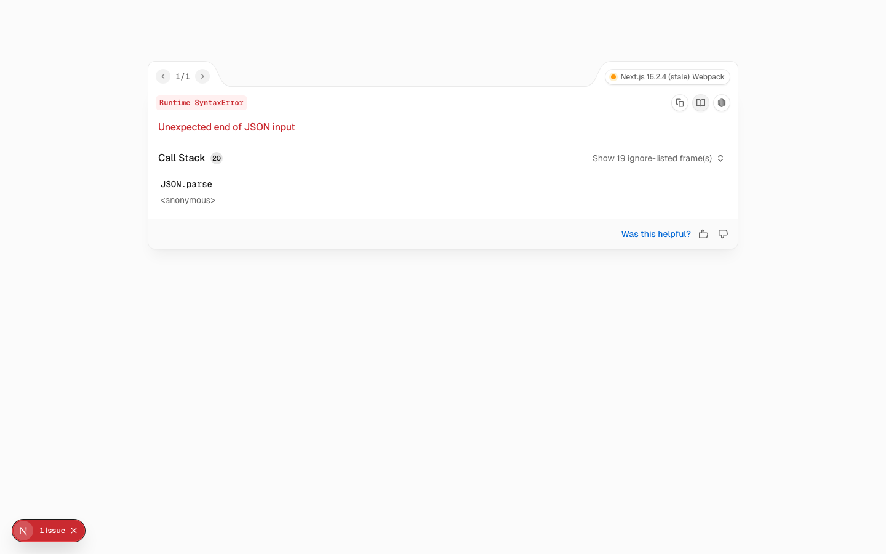

# Iteration: home — globals

| 項目 | 值 |
|------|----|
| 時間 | 2026/6/6 下午12:50:47 |
| 頁面 | http://localhost:3000/ |
| 元件 | `globals` |
| 檔案 | `app/globals.css` |
| 截圖範圍 | 頁面頂部（找不到元件，已退回整頁） |

## Before


## After


## 設計說明

- **Before 的問題**：圖卡動畫在進場時初始透明度為 50%，導致畫面中先出現半透明的影像，視覺層次不夠明確，動畫的「淡入」效果不足，無法清晰傳達內容從無到有的視覺層級。

- **After 的改動**：將初始透明度從 0.5 改為 0（完全透明），讓圖卡從絕對隱形開始淡入，強化動畫的進場感受，使整個視覺流程更加乾淨俐落。這樣的改動確保圖卡在動畫時間軸中有完整的淡入曲線，配合迴紋針與圖卡的置中一體化，整個元件組合能以統一的動畫語言進場，提升視覺敘事的完整度。

<details>
<summary>Code diff</summary>

**Before:**
```
@keyframes growthPhotoBlueIn {
  from {
    opacity: 0.5;
    filter: saturate(0.85);
    transform: perspective(1200px) translate(20px, -20px) rotate(-9deg) rotateX(20deg);
  }
```

**After:**
```
@keyframes growthPhotoBlueIn {
  from {
    opacity: 0;
    filter: saturate(0.85);
    transform: perspective(1200px) translate(20px, -20px) rotate(-9deg) rotateX(20deg);
  }
```

</details>