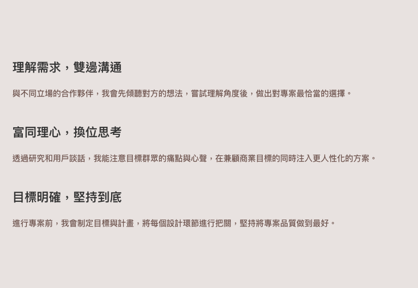

# Iteration: about-me — traits-list

| 項目 | 值 |
|------|----|
| 時間 | 2026/6/6 下午12:53:08 |
| 頁面 | http://localhost:3000/about-me |
| 元件 | `traits-list` |
| 檔案 | `app/globals.css` |
| 截圖範圍 | 元件範圍 |

## Before


## After


## 設計說明

- **Before 的問題**：進場動畫直接播放，沒有考慮使用者的系統無障礙偏好設定；對於開啟「減少動態效果」選項的使用者（如前庭失調、暈動症患者）會造成不適體驗，無法提供包容性的設計。

- **After 的改動**：新增 `@media (prefers-reduced-motion: reduce)` 媒體查詢，偵測使用者的無障礙偏好；當使用者啟用「減少動態效果」時，growth-story 和 growth-polaroid 四個元素會跳過進場動畫，直接顯示最終狀態（opacity: 1、animation: none）；這樣既保留了預設使用者的動畫設計，又確保不同使用者族群都能無障礙地瀏覽頁面，符合 WCAG 無障礙標準。

<details>
<summary>Code diff</summary>

**Before:**
```
  to {
    opacity: 1;
    filter: saturate(1);
    transform: perspective(1200px) translate(0, 0) rotate(9deg) rotateX(0);
  }
}

.traits-list h3,
```

**After:**
```
  to {
    opacity: 1;
    filter: saturate(1);
    transform: perspective(1200px) translate(0, 0) rotate(9deg) rotateX(0);
  }
}

/* 尊重「減少動態效果」偏好：直接顯示最終狀態，不播進場動畫 */
@media (prefers-reduced-motion: reduce) {
  .growth-story-blue,
  .growth-story-orange,
  .growth-polaroid-blue,
  .growth-polaroid-orange {
    opacity: 1;
    animation: none;
  }
}

.traits-list h3,
```

</details>