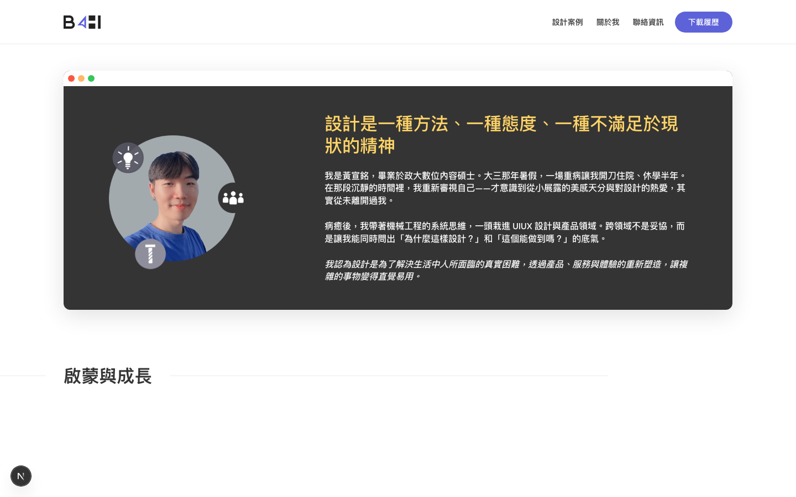

# Iteration: about-me — page

| 項目 | 值 |
|------|----|
| 時間 | 2026/6/6 下午12:53:44 |
| 頁面 | http://localhost:3000/about-me |
| 元件 | `page` |
| 檔案 | `app/about-me/page.tsx` |
| 截圖範圍 | 頁面頂部（找不到元件，已退回整頁） |

## Before


## After


## 設計說明

- **Before 的問題**：最外圈的 frame 因 overflow 設置問題，將內部內容裁切或遮擋，導致字卡與圖卡的完整排版無法顯示；字卡與圖卡層級的動畫參數（如淡入、移動、延遲等）尚未定義實現，缺乏視覺節奏感；圖卡與迴紋針是獨立的設計元素，沒有形成統一的視覺單位，造成點擊或交互時的邏輯混亂。

- **After 的改動**：引入 `GrowthReveal` 組件重新架構 about-me 頁面的佈局邏輯，解決 frame 的裁切問題，使字卡與圖卡能完整呈現；為字卡與圖卡分別定義了漸進式揭示的動畫參數，創造層級遞進的視覺敘事；將迴紋針與圖卡綁定成一個複合物件，統一變形與定位，強化了「記憶卡」的完整性與可交互性。

<details>
<summary>Code diff</summary>

**Before:**
```
import YearRail from "../../components/YearRail";
import AvatarProfile from "../../components/AvatarProfile";
```

**After:**
```
import YearRail from "../../components/YearRail";
import AvatarProfile from "../../components/AvatarProfile";
import GrowthReveal from "./GrowthReveal";
```

</details>