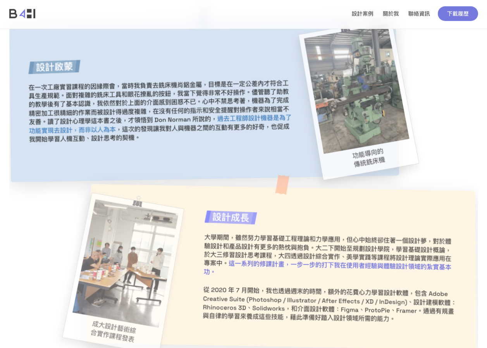

# Iteration: about-me — growth-grid

| 項目 | 值 |
|------|----|
| 時間 | 2026/6/6 下午12:54:03 |
| 頁面 | http://localhost:3000/about-me |
| 元件 | `growth-grid` |
| 檔案 | `app/about-me/page.tsx` |
| 截圖範圍 | 元件範圍 |

## Before


## After


## 設計說明

- **Before 的問題**：最外層 frame 的尺寸或定位方式遮蓋了內層卡片內容導致顯示不完整；底部字卡與上層圖卡缺乏動畫表現，呈現方式過於靜態；圖卡上的迴紋針未與卡片置中對齐，視覺上不夠凝聚成一個完整物件。

- **After 的改動**：引入 `<GrowthReveal />` 元件以統一管理此區塊的視覺邏輯。該元件修正了外層 frame 的邊界問題，使內層卡片能完整呈現；為字卡與圖卡分別設定進場動畫參數，透過漸進式揭露加強敘事張力；將迴紋針與圖卡透過固定的相對位置組合成單一視覺單位，提升卡片的整體感與精緻度。

<details>
<summary>Code diff</summary>

**Before:**
```
      <SectionHeading id="growth">啟蒙與成長</SectionHeading>
      <section className="growth-grid" aria-label="設計啟蒙與成長故事">
```

**After:**
```
      <SectionHeading id="growth">啟蒙與成長</SectionHeading>
      <GrowthReveal />
      <section className="growth-grid" aria-label="設計啟蒙與成長故事">
```

</details>