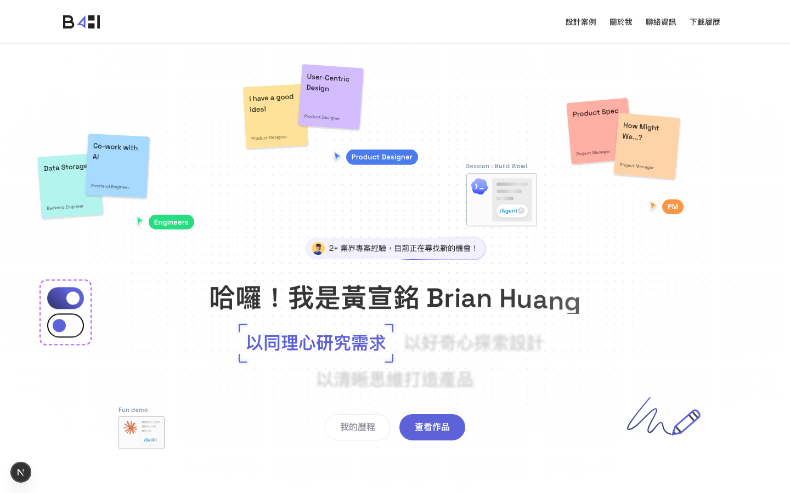

# Iteration: home — globals

| 項目 | 值 |
|------|----|
| 時間 | 2026/6/8 下午1:23:25 |
| 頁面 | http://localhost:3000/ |
| 元件 | `globals` |
| 檔案 | `app/globals.css` |
| 截圖範圍 | 頁面頂部（找不到元件，已退回整頁） |

## Before


## After


## 設計說明

- **Before 的問題**：按鈕未定義明確的字級，依賴父層繼承導致字級不可控，在不同斷點上無法隨視口寬度調整，特別是小螢幕裝置上容易出現字級過大導致內容溢出或按鈕比例失調的問題。

- **After 的改動**：改為使用 CSS 變數 `var(--fs-body)` 明確定義按鈕字級，讓字級與設計系統的響應式文字階梯一致，從而能在各斷點上動態調整——大螢幕保持視覺重量感，小螢幕適當縮小字級以保持按鈕與 48px 最小高度的視覺比例，確保所有裝置上都有完整、不溢出的互動元件。

<details>
<summary>Code diff</summary>

**Before:**
```
  min-height: 48px;
  padding: 12px 24px;
  border-radius: 200px;
  font-weight: 600;
  line-height: 1.4;
  transition: background-color 180ms ease;
}
```

**After:**
```
  min-height: 48px;
  padding: 12px 24px;
  border-radius: 200px;
  font-size: var(--fs-body);
  font-weight: 600;
  line-height: 1.4;
  transition: background-color 180ms ease;
}
```

</details>