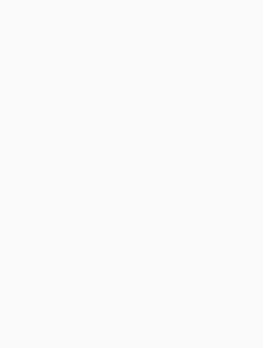

# Iteration: home — project-button

| 項目 | 值 |
|------|----|
| 時間 | 2026/6/8 下午1:23:45 |
| 頁面 | http://localhost:3000/ |
| 元件 | `project-button` |
| 檔案 | `app/globals.css` |
| 截圖範圍 | 元件範圍 |

## Before


## After


## 設計說明

- **Before 的問題**：按鈕缺少垂直對齊控制（只有 `justify-content` 無 `align-items`），導致文字在不同內容或斷點下位置不穩定；沒有明確宣告字級，依賴父層繼承，在不同螢幕尺寸上字級表現不一致；缺少最小高度限制，按鈕高度隨內容浮動，無法在各斷點維持穩定的點擊區域。

- **After 的改動**：增加 `align-items: center` 確保文字垂直居中對齐，視覺上更穩定；設定 `min-height: 48px` 建立無障礙標準的最小觸控區域，在所有斷點保持一致高度；明確指定 `font-size: var(--fs-body)` 以 CSS 變數控制字級，不依賴繼承，確保在各斷點上字級表現一致。三項修改合力讓按鈕在響應式設計中保持視覺和互動的穩定性。

<details>
<summary>Code diff</summary>

**Before:**
```
.project-button {
  display: inline-flex;
  justify-content: center;
  width: 100%;
  padding: 12px 0;
  border-radius: 200px;
  color: white;
  font-weight: 600;
}
```

**After:**
```
.project-button {
  display: inline-flex;
  align-items: center;
  justify-content: center;
  width: 100%;
  min-height: 48px;
  padding: 12px 0;
  border-radius: 200px;
  color: white;
  font-size: var(--fs-body);
  font-weight: 600;
}
```

</details>